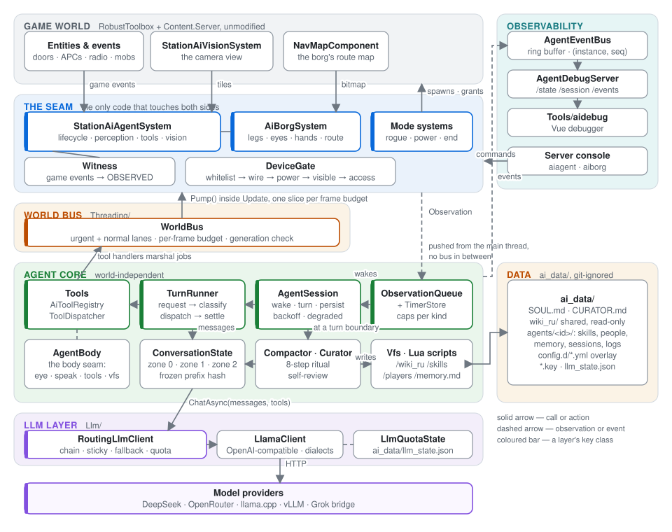
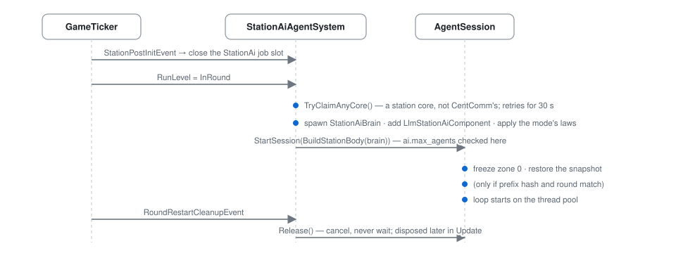
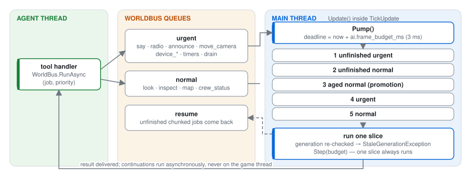
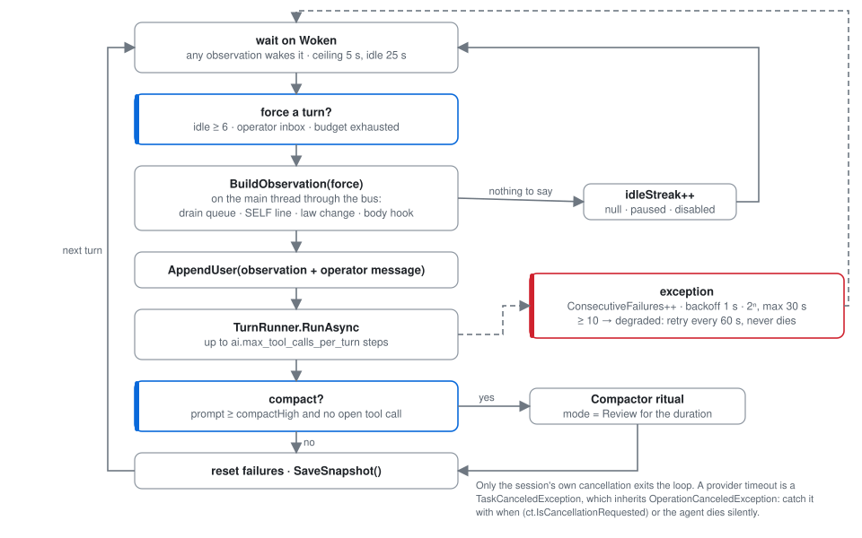
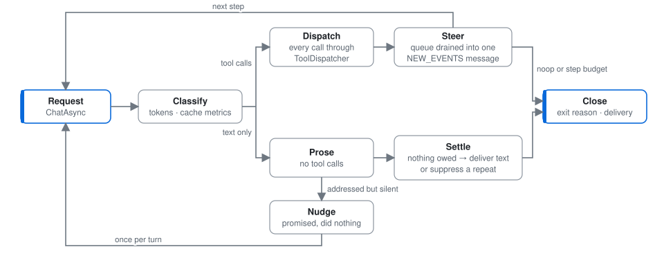
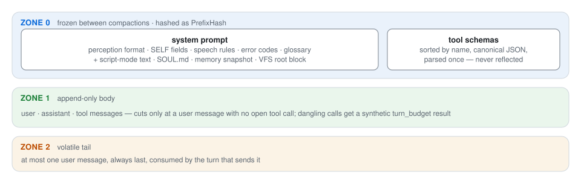
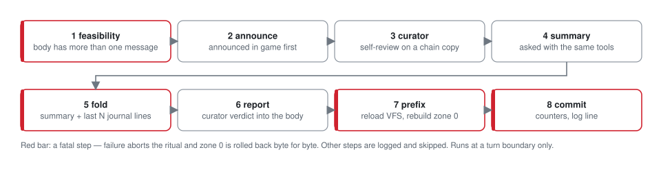
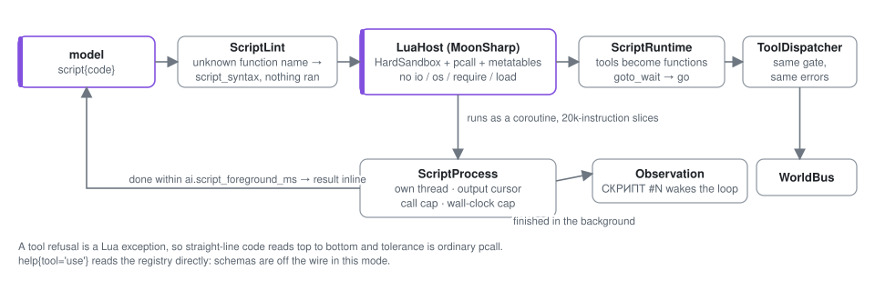
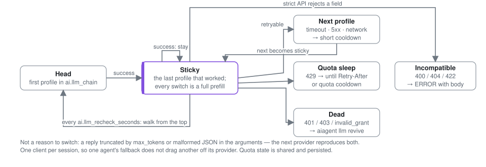
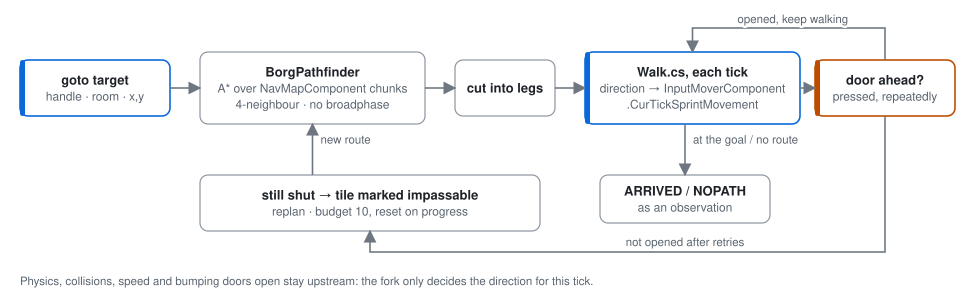

# AiAgent — an LLM plays the Station AI

`Content.Server/AiAgent/` is the whole of this fork's code: a language model plays the Station AI
role in [Space Station 14](https://github.com/space-wizards/space-station-14), and optionally a
squad of cyborgs. The model sees the station through its cameras, hears the radio and the speech
near its core, operates doors, airlocks and consoles through the same permission checks a human
player goes through, keeps its own notes and memory between shifts, and can turn against the crew
when the round's game mode says so.

The fork adds new files only. Upstream files are not edited, so `git rebase upstream/master`
stays cheap; every exception is listed in [`docs/upstream-patches.md`](../../docs/upstream-patches.md).

> **Before you host this publicly.** Everything the agent hears leaves your server and goes to
> whichever model provider you configure: radio chatter, speech near the AI core and near the
> cyborgs, announcements. Account names, IPs and Steam IDs are not sent; character names are,
> because any player standing nearby sees them too. Tell your players before they connect. See
> [Privacy](#privacy).

---

## Contents

- [Why](#why)
- [What is in the box](#what-is-in-the-box)
- [Architecture](#architecture)
  - [The whole picture](#the-whole-picture)
  - [Layer 1 — the game world and the seam](#layer-1--the-game-world-and-the-seam)
  - [Layer 2 — the world bus](#layer-2--the-world-bus)
  - [Layer 3 — the agent core](#layer-3--the-agent-core)
  - [Layer 4 — the LLM layer](#layer-4--the-llm-layer)
  - [Layer 5 — the agent's data](#layer-5--the-agents-data)
  - [Layer 6 — observability](#layer-6--observability)
  - [Bodies: the station core and the cyborg](#bodies-the-station-core-and-the-cyborg)
  - [Game modes](#game-modes)
- [Source layout](#source-layout)
- [Getting started](#getting-started)
- [Configuration](#configuration)
- [Operating a live server](#operating-a-live-server)
- [Testing](#testing)
- [Design rules](#design-rules)
- [Known limitations](#known-limitations)
- [Further reading](#further-reading)
- [Privacy](#privacy)
- [License](#license)

---

## Why

Station AI is the one role in SS14 that is played almost entirely through text and remote
controls: you listen, you look through cameras, you open doors, you talk. That makes it the one
role a language model can play without pretending to have a body. The goal of this module is to
make that role *good*: an AI that answers the radio, remembers who asked for what, notices
things happening in front of its cameras, keeps its laws, and, in the rogue game modes, becomes
a real antagonist with real constraints.

Three constraints shaped everything below:

1. **Parity with a human player.** The agent may not do anything a human Station AI could not:
   no teleporting, no omniscience, no channels it does not have. Every action goes through the
   same visibility, power, wire and access checks as a click.
2. **No upstream edits.** New `EntitySystem`s, new prototypes, new console commands, one build
   props file. Nothing else.
3. **The game tick is sacred.** The agent runs on its own threads and buys main-thread time in
   budgeted slices. A slow model must never look like a lagging server.

## What is in the box

| | |
|---|---|
| **Agent core** | A turn loop driven by observations, a tool registry with a fixed error vocabulary, a three-zone conversation that keeps the provider's prefix cache warm, context compaction with a self-review step |
| **Bodies** | The immobile Station AI core and a walking cyborg; the same loop drives both through a small `AgentBody` seam |
| **Perception** | Radio, nearby speech, announcements, alerts, law changes, arrivals, timers, and a stream of witnessed events (`OBSERVED …`) from the camera view |
| **Agent filesystem** | A read-only game wiki, a writable skill tree, per-person notes and a memory file, exposed through `sh`, `write_file`, `edit_file` |
| **Script mode** | Optional: the model writes a sandboxed Lua program per turn instead of one tool call per round trip |
| **Providers** | A chain of model profiles with sticky fallback, quota tracking, dialect-aware wire format; DeepSeek, OpenRouter, llama.cpp, vLLM, Grok through a bridge |
| **Game modes** | Peaceful AI, hidden rogue AI, open rogue AI with a cyborg squad; backup power for shifts without engineers |
| **Observability** | An HTTP event bus with a Vue debugger, per-operation main-thread cost, tick-time histograms, console commands to probe every layer |
| **Test bench** | `Content.AiBench`: ~60 test files that boot a real server and assert on world state, with a scripted stand-in for the model |

---

## Architecture

### The whole picture

Read the diagram top to bottom: the game world sits at the top, the model provider at the
bottom, and the agent core in between never touches the entity world directly. Everything
crossing from the core into the world goes through the world bus; everything crossing from the
world into the core is an `Observation`.



The rest of this section walks the layers one at a time.

### Layer 1 — the game world and the seam

`StationAiAgentSystem` is, by its own header comment, the only class that touches both the
entity world and the agent. `Llm/`, `Context/`, `Perception/`, `Turn/`, `Handles/`,
`Threading/`, `Skills/`, `Vfs/` and `Tools/` never name `IEntityManager`.

**Lifecycle.** When a round reaches `InRound`, the system looks for a Station AI core on a
station grid, skipping CentComm's core, and spawns (or reuses) a `StationAiBrain` inside it. The
brain gets an `LlmStationAiComponent` marker and a session starts. On round restart every session
is released and the LLM client is rebuilt. Releasing never waits for the loop to finish: waiting
inside `TickUpdate` was a measured two-second server stall, so the session drains in the
background.



**Perception inputs.** Each becomes an `Observation` pushed onto the session's queue from the
main thread:

| Input | Source | Gate |
|---|---|---|
| Radio | `RadioReceiveEvent` on the marker component | own transmissions dropped |
| Speech | `EntitySpokeEvent` | distance from the **core** (a Station AI has no camera microphones), `ai.hear_range`, not already heard on radio |
| Announcements | `StationAnnouncementEvent` (raised from upstream chat on all dispatch paths, patch К3) | own station, not self |
| Alerts | `AlertLevelChangedEvent` | own station |
| Laws | polled before each observation | change since last turn |
| Arrivals, carding, death | `PlayerSpawnCompleteEvent`, container messages, `MobStateChangedEvent` | |
| Timers | `TimerStore.TakeDue` in `Update` | round time |
| Witnessed events | see below | distance from the eye |

**Witness** (`StationAiAgentSystem.Witness.cs`) subscribes to interaction, container,
pulling, equip, mob-state, damage, gunshot and door-state events and turns each into one line:

```
OBSERVED предметом | crew-7 Иван Петров | obj-412 лист плазмы | device-3 генератор аномалий | Δ(2,-1) (12,-34)
```

There is no semantic filter. The code delivers who, what, with what and where; deciding what it
means is the model's job. The only gate is a square distance check from the eye
(`ai.observe_range`); wall occlusion is optional (`ai.observe_occlusion`) because it costs
hundreds of broadphase queries per event. Handles in these lines are the same ones `look` hands
out, so the model can act on `device-3` immediately without a fresh sweep.

**Vision.** `look` runs the upstream camera view (`StationAiVisionSystem.GetView`) as a
sliced job (`Vision/SlicedView.cs`) that spans several frames, then gathers entities with one
broadphase query over the visible bounding box (`GatherByBounds`). The old per-tile path was
O(tiles × entities) and once held the main thread for 1.9 s; it is kept behind `ai.look_fast
false` for the equivalence test.

**The action gate.** Every device tool walks the same chain a human click walks, in this
order: playable → not carded → device has `StationAiWhitelist` → its wire is not cut → powered →
visible from a camera → access allowed. `Tools/DeviceGate.cs` maps each link to a `ToolError`, a
detail line and a retry hint, so the model learns *why* and whether moving the eye would help
(it would not: visibility is computed from cameras near the target).

**Device control.** Actions are raised as the same messages a client would send, with
`Actor = brain`: `StationAiBoltEvent`, `StationAiElectrifiedEvent`, APC breaker, air-alarm mode.
`device_ui` reflects over a console's bound-UI state and its message types (`Tools/UiContract.cs`,
`Tools/UiActionIndex.cs`), so any console the AI is whitelisted for is operable without a
per-console driver.

### Layer 2 — the world bus

Agent threads never touch entities. Every tool handler marshals its body through
`WorldBus.RunAsync`, and `StationAiAgentSystem.Update` drains the bus inside the tick with a
per-frame budget (`ai.frame_budget_ms`, default 3 ms, about 9 % of a 30 Hz frame).



Three properties are load-bearing:

- **One slice always runs** before the first deadline check. An overloaded server that never has
  budget would otherwise freeze the agent forever, silently.
- **Generation is re-checked on the main thread before every slice.** The AI can be carded
  between two slices of one `look`; the job fails with `StaleGenerationException` and the tool
  answers `dead` instead of acting on a body that no longer exists.
- **Continuations run asynchronously.** `Complete()` is called from inside `TickUpdate`; an
  inline continuation would drop a multi-second HTTP call into the middle of the system update.

`ai.world_bus false` restores the pre-bus path (`ITaskManager.RunOnMainThread`, no budget).
`Pump()` deliberately ignores the switch so already-queued work still drains. `aiagent cost`
shows per-operation p50/p95/max/total and the queue counters; overflows, deferrals and worst wait
should be zero on a healthy server.

### Layer 3 — the agent core

#### The loop

`AgentSession` owns the conversation, the observation queue and one background loop on the
thread pool. It wakes on a `SemaphoreSlim(0, 1)`: any observation arriving releases it, and a
burst of chatter starts exactly one turn. The wait is a ceiling, not a period: `ai.tick_seconds`
(5 s) normally, `ai.tick_seconds_idle` (25 s) after three idle turns.



Only the session's own cancellation exits the loop. `HttpClient.Timeout` throws a
`TaskCanceledException`, which inherits from `OperationCanceledException`; catching the base type
without a `when (ct.IsCancellationRequested)` filter once silenced the agent for the rest of a
round with a log line that read like a normal shutdown.

#### One turn

`TurnRunner` is a small state machine over `TurnContext`:



- A turn runs up to `ai.max_tool_calls_per_turn` (90) tool calls; each is one model round trip
  because `parallel_tool_calls` is off.
- After each batch of calls the queue is drained into a single `NEW_EVENTS` user message, so a
  multi-step turn does not go deaf.
- Exit reasons are explicit: `ModelStopped`, `Idled`, `BudgetExhausted`, `Cancelled`, `Failed`,
  orthogonal to how speech was delivered. Every loop exit names its reason; the journal and the
  bus disagreeing about why a turn ended was a real debugging cost once.
- `noop` is the only tool that ends a turn; it works while carded and in review mode.

#### Observations

`ObservationQueue` is a linked list under one lock with two caps: `ai.obs_buffer` drops the
oldest line of any kind, and `ai.observe_buffer` (400) trims only the oldest `OBSERVED` lines
first, so a busy camera view cannot push a radio call out of the queue. Kinds, in the order they
are rendered: `Radio, Speech, Announce, Alert, Laws, Event, Timer, Arrival, Note, Observed`.
The formatted message is a `[T+H:MM:SS]` header, the lines, a `SELF` line with the same fields
in the same order every time (mode, eye position, channel, timers, running scripts, and for a
cyborg its charge), and `DROPPED n` if anything was lost.

An `Observation` carries no `EntityUid`, for thread safety and for parity: a raw uid behind a
voice is a metagame key a human player does not have.

#### Entity handles

`Handles/EntityHandleRegistry.cs` is per session. It mints `door-3`, `crew-7`, `apc-1` from a
per-kind counter and only for entities the agent has actually perceived. Uids are never reused,
so a pruned handle can only become `stale_handle`, never point at something else.

#### Tools

`AiTool` = name, description, a hand-written canonical JSON schema (a reflection-generated
schema could reorder properties and invalidate the prefix cache), a handler, and four flags:
`Wire` (visible to the model), `GameAction` (refused during review), `Speech`, `EndsTurn`.

`ToolDispatcher.InvokeAsync` is the single door for the loop, the curator, Lua scripts, the
console and the tests: resolve → gate → parse → run. Unknown names come back with
Levenshtein-nearest alternatives; a timeout is reported with `retry: none` because the delegate
may still execute later and bolting a door twice is worse than not retrying.

`ToolResult` is one envelope everywhere: `ok`, `error` from a fixed vocabulary
(`bad_args, stale_handle, not_visible, not_controllable, no_access, unpowered, wire_cut, carded,
dead, timeout, review_mode, turn_budget, refused, script_syntax, script_error, script_budget,
no_process, internal, unknown_tool`), `detail`, `retry` (`later | other_target | none`),
`alternatives`, and `effect`: the world state read back **after** the mutation. A tool that says
`ok` while the door stays shut is exactly the bug the bench exists to catch.

#### Context: three zones and a frozen prefix

The provider's prefix cache is the module's economics. A shift with eight agents costs about two
dollars on DeepSeek at 99 % cache hits and several times more without. So `ConversationState`
is built around one rule: **every prompt is a strict continuation of the previous one.**



`Context/CacheMetrics.cs` watches the prefix: a hash change outside a compaction, or cache reuse
under 90 % of the reusable ceiling two turns running, is logged as an error. Providers that do
not report cache usage (`reportsCache: false`) keep the watchdog quiet; a metric that shouts
without a fault devalues the one instrument that catches a silent cache break.

Laws are not in zone 0; they arrive as `LAWS` observations when they change. Player notes and a
skills index are deliberately absent too: both would grow the frozen prefix on every write.

#### Compaction

Triggered at a turn boundary when the last prompt reached the profile's `compactHigh` (or
`ai.compact_high`, 90 000) and no tool call is open. There is no low-water mark; one fold that
left 162k tokens against a 45k threshold and never re-armed removed it.



Steps 1, 5, 7 and 8 are fatal; the rest are logged and skipped. If the ritual does not commit,
zone 0 is rolled back byte-for-byte and the cache watchdog is told to expect a miss.

#### Curator

The curator is the agent reviewing its own shift. It is one extra turn on a **copy** of the live
chain, with the **identical** tool array; game tools stay in the schema and refuse with
`review_mode` at dispatch. Its prompt is `ai_data/CURATOR.md`, mounted read-only at
`/curator.md` (an instruction the review could rewrite stops being an instruction). It writes
`/memory.md`, `/players/<slug>` and `/skills/...` through the same `sh`/`write_file`/`edit_file`
tools as the main loop. Its closing sentences come back into the conversation as `CURATOR …`
only if it actually wrote something, measured as VFS writes rather than wire calls so script mode
counts too.

#### The agent filesystem

| Mount | Access | Backed by |
|---|---|---|
| `/wiki_ru` | read | shared `DocTree` over `ai_data/wiki_ru/` (one instance for all agents) |
| `/wiki_en` | read | in-game Guidebook prototypes, raw markup; the English machine names players see on screens |
| `/skills` | read/write | per-agent `DocTree` over `<agent>/skills/` |
| `/players` | read/write | `PlayerNoteStore` over `<agent>/people/`, every entry stamped `[round N · date]` by the server |
| `/memory.md` | read/write | `MemoryStore`, frozen snapshot in zone 0, 4 000-character cap |
| `/curator.md` | read | `CURATOR.md` |

Three tools: `sh` (`ls tree cat grep find mkdir rm mv pwd`, no pipes or redirects, output caps
always announced), `write_file`, `edit_file`. Permissions belong to the mount and cannot be
changed by the agent. The mount table renders into zone 0 as a constant block of about 700
characters; the previous flat skills index was 16 000 characters and changed on every write.

Mount order is part of the prefix hash, which is why `VfsBuilder` keeps it as a list and not a
dictionary.

#### Script mode

In classic mode every elementary action costs a model round trip; a live cyborg log showed 1.03
tool calls per request and 2.5 hours of model time for 37 turns. In script mode the model writes
a Lua program and the wire carries only `script`, `bp_get_output`, `bp_stop` and `noop`. It is
either/or per body (`ai.script_mode`, `AgentBody.ScriptMode`), decided once when the body is
built.



A refusal is a Lua exception, so straight-line code reads top to bottom and tolerance is
ordinary `pcall`. `help{tool='use'}` reads the registry directly, because in script mode the
schemas are off the wire and a second, hand-written copy in the prompt would drift. Limits:
`ai.script_max_processes` (2), `ai.script_max_seconds` (300, real seconds), `ai.script_max_calls`
(400), `ai.script_max_steps` (5 M instructions), `ai.script_output_lines` (200).

MoonSharp is the fork's one added package, declared in `Content.Server/Directory.Build.props`
so that no upstream project file changes. Roslyn scripting was rejected: no way to stop a
`while(true)`, no sandbox, and script assemblies never unload.

### Layer 4 — the LLM layer

`ILlmClient` has two members: `ChatAsync(messages, tools)` and `GetContextSizeAsync()`. The
bench substitutes a scripted client through `AiTestHooks.LlmFactory`.

`LlamaClient` speaks OpenAI-compatible `chat/completions`, non-streaming, one tool call at a
time. The **dialect** decides which fields go on the wire: `top_k`, `min_p`, `cache_prompt`,
`id_slot` only for `LlamaCpp`; the `thinking` object only for `DeepSeek`; top-level
`reasoning_effort` only for `OpenAiCompat`. Strict servers such as vLLM answer 400 to unknown
fields, and "provider is down" must stay distinguishable from "provider did not like the fourth
field". Proxy is per profile (`None` for loopback, `Socks` for the internet), because a global
`HTTP_PROXY` hangs loopback requests until timeout.

`RoutingLlmClient` wraps a chain of profiles (`ai.llm_chain`, e.g. `deepseek-pro,deepseek,awq`):



What does **not** cause a switch: a response truncated by `max_tokens` or malformed JSON in the
arguments. Those reproduce identically on the next provider.

One client is built **per session**, so one agent's fallback does not drag another agent off its
working provider. Quota state is shared and persisted in `ai_data/llm_state.json`: the client is
rebuilt on every round restart, and a 429 cooldown that did not survive the restart would burn
the remainder of a weekly pool on probes. `aiagent llm` shows the chain, sleepers and spend.

The whole call has a budget, `ai.llm_total_timeout`, and each profile has `timeoutSeconds`. If a
non-last profile's timeout is not smaller than the total budget, the fallback is never tried;
`aiagent llm probe` checks this and four other silent misconfigurations with a real request.

### Layer 5 — the agent's data

`ai_data/` lives next to the repository, is git-ignored, and holds everything that must survive
an upstream rebase: personality, memory, keys. The core agent uses the root; every other body
uses `ai_data/agents/<id>/`.

```
ai_data/
  SOUL.md                    personality of the peaceful Station AI (hand-written, optional)
  SOUL_ROGUE_HIDDEN.md       personalities per mode / per borg role; a per-agent copy overrides
  SOUL_ROGUE_OPEN.md         the root one (RoleFile)
  CURATOR.md                 the self-review prompt, {{КОРЕНЬ}} is replaced by the VFS root
  wiki_ru/                   read-only reference library, one shared instance
  memory/MEMORY.md           the core agent's memory
  people/<slug>.md           the core agent's notes about characters
  skills/                    what the core agent writes itself
  sessions/<id>.json         conversation snapshot, written after every turn
  logs/events-YYYY-MM-DD.jsonl
  agents/<id>/               same layout for each cyborg (combat-1, engineer-1, …)
  config.d/*.yml             prototype overlay, read alphabetically (see Configuration)
  llm_state.json             per-profile quota, cooldown and spend
  *.key                      provider keys; profiles name the file, never the value
```

The reference library is versioned in the repository as `skill_start/` (hand-written) and
`wiki_skills/` (extracted from the in-game Guidebook and linted); `Tools/vfs/migrate.py` lays a
flat copy out into the `wiki_ru/` tree. See [Getting started](#getting-started).

Secrets can never live in `Resources/`: `ContentMagicAczProvider` serves that whole folder to
every connecting client. This is why `llm_profiles.yml` contains `keyFile: deepseek.key` and
not a key.

### Layer 6 — observability

- **Journal.** `logs/events-*.jsonl` records every step, tool call and turn exit, and is the
  source of the compaction tail.
- **Event bus.** `AgentEventBus` is a ring of pre-serialised events (`session.started`,
  `message.appended`, `history.replaced`, `prefix.replaced`, `memory.updated`, `skill.updated`,
  `note.updated`, `stats`, …) with a `(instance, seq)` cursor, so a process restart shows as a
  resync rather than silence.
- **Debug server.** `AgentDebugServer` is a standalone `HttpListener` on `ai.debug_bind`
  (default `127.0.0.1:9080`), bearer-token protected. Routes: `GET /health`, `GET /state`
  (process-wide stores + roster), `GET /session?agent=<id>` (prompt, conversation, stats; unknown
  agent is `200` with `agent: null`, never `404`, because the roster changes between polls),
  `GET /events?instance=&since=` (long poll), `POST /command` (`message.send` to an agent,
  `memory.change`, `skill.change`). Operator messages are prefixed
  `[ВНЕИГРОВОЕ СООБЩЕНИЕ ОПЕРАТОРА СЕРВЕРА]` so they cannot be mistaken for radio.
- **Debugger UI.** `Tools/aidebug/`, Vue 3 + Vite: conversation, memory, skills, notes, prompt,
  stats, bus tabs, and a send box, for every live agent.
- **Tick attribution.** Every 30 s the log prints the tick-interval distribution and the share of
  main-thread time spent on the agent, computed against measured wall time so a lagging server
  cannot inflate the agent's share. `aiagent cost` breaks it down per operation.
- **Console.** `aiagent status | claim | release | cost | llm | config | mode | inject | tool |
  curate | skills | ls | timers | debug | dryrun` and `aiborg list | spawn | claim | release |
  tool | path | where`. `aiagent tool <name> <json>` invokes any registry tool from the console,
  script-only ones included.

### Bodies: the station core and the cyborg

`Core/AgentBody.cs` is the seam between the loop and a body. Everything world-specific is a
field on it; the loop, conversation, compaction and routing know nothing about entities.

| Field | Station AI core | Cyborg |
|---|---|---|
| `Id` | `core` | allocated: `borg-1`, `combat-2`, `engineer-1` |
| `Eye` | the camera eye entity | the chassis itself |
| `Alive` | `IsPlayable` (core powered, not carded) | chassis alive |
| `BuildPrompt` | station prompt | borg prompt (no cameras, has legs and hands) |
| `SelfLine` | mode, eye, channel, timers | plus grid position and charge |
| `BeforeObservation` | — | field-of-view delta since last turn |
| `RegisterTools` | station tools | borg tools |
| `Announce` | comms console on the brain | `null`: no such organ, compaction warning is spoken instead |
| `Speak` | say / radio | say / radio |
| `ChannelsFor` | channels of the AI headset | channels of the chassis |
| `Vfs` | root `ai_data/` | `ai_data/agents/<id>/` |
| `SoulFile`, `LlmChain`, `ScriptMode`, `Curate` | per mode | per prototype; `Curate` off |

Both factories, `StationAiAgentSystem.BuildStationBody` and `AiBorgSystem.BuildBody`, fit on a
screen.

**Station tools.**

| Group | Tools |
|---|---|
| Perception | `look` (camera sweep around the eye, `expand` 0–3, `kind`, `near`), `inspect` (bolts, electrification, APC state, air alarm, cut wire, required access; `by` answers whether a person's ID opens it), `map` (beacons and distances), `crew_status` (suit sensors), `identify`, `records`, `station_status` |
| Speech | `say` (heard near the core), `radio` (station channels), `set_channel`, `announce` (station-wide, alert level) |
| Movement | `move_camera`, `jump_to_core` |
| Devices | `device_action` (open, close, bolt, unbolt, electrify, emergency access, APC breaker, air-alarm mode), `device_ui` (read a console and act on it) |
| Common | `laws`, `noop`, `new_timer` / `del_timer` / `list_timers`, `sh` / `write_file` / `edit_file` |

Timers are the agent's way of scheduling its own turn ("I will check in ten minutes"). They run
in **round time**, so a paused empty server does not wake the model, and a fired timer is just
another observation line, `TIMER <name>: "<text>"`.

**The cyborg** (`Borg/`) is a chassis on the engineering borg base with a headless mind (the
upstream borg system refuses to activate without one). What it deliberately does *not* get:
`announce`, `device_action`, `device_ui`, `move_camera`, `jump_to_core`, `crew_status`,
`station_status`. A robot does not open a door remotely; it walks to it.

| Group | Tools |
|---|---|
| Legs | `goto` (handle, room name or grid coordinates; returns at once, `ARRIVED` / `NOPATH` arrive as observations), `step` |
| Eyes | `look` (radius plus one occlusion ray per candidate, not the camera network), `examine` |
| Hands | `use` (press, or apply the held item with `with_item`, choosing a `tool` from the module), `pickup`, `drop`, `hit`, `shoot`, `module`, `console` |
| Speech | `say`, `radio`, `set_channel` |
| Helpers | `find_charger`, `ame_plan` |
| Script-only | `goto_wait` (`go` in Lua), `use_wait`, `walk_status` |

Movement is the fork's own: `BorgPathfinder` runs A* over the `NavMapComponent` bitmap the game
already builds for handheld navigation tablets (upstream pathfinding stops at 512 nodes and
cannot cross a station), and `AiBorgSystem.Walk.cs` writes the direction into
`InputMoverComponent.CurTickSprintMovement`, the same field a player's client writes. Physics,
collisions, speed and bumping doors open stay upstream. A door that does not open after repeated
presses is marked impassable for the route and the next path goes around it.



The borg's eyes produce three layers of world difference: the `OBSERVED` event stream, `look`
on demand, and a per-turn field-of-view delta (`appeared / disappeared / changed`) that stays
silent while walking, because ten tiles of movement would otherwise flood the queue and push a
radio call out.

### Game modes

All modes are ordinary presets in `Resources/Prototypes/_AiAgent/rogue_ai.yml`, selectable from
the lobby vote, `forcepreset`, or the secret pool. Each rule carries the same `RogueAiRule`
component; what makes a mode rogue is its values.

| Preset | Aliases | Laws | Personality | Crew jobs | AI access | Cyborgs |
|---|---|---|---|---|---|---|
| `AiPeaceful` | `peaceai` | Crewsimov | `SOUL.md` | normal | normal | one engineer |
| `RogueAiHidden` | `malf`, `rogue` | 4 laws incl. a secret one | `SOUL_ROGUE_HIDDEN.md` | normal | extended | one rogue engineer |
| `RogueAiOpen` | `malfopen`, `evilai` | 4 laws, announced by CentComm | `SOUL_ROGUE_OPEN.md` | everyone is a passenger | extended | six combat + one engineer |

What happens at round start:

1. `RulePlayerSpawningEvent`: in open mode all jobs except passenger are closed, and players who
   asked to stay in the lobby are switched to overflow so nobody is silently refused a spawn.
2. `RulePlayerJobsAssignedEvent`: `StationAiWhitelist` is added to every anchored door, console
   and turret on station grids that does not already have one (a cut AI wire is never repaired),
   support cyborgs spawn at named beacons, and the optional announcement goes out.
3. On core claim, laws are applied through `IonStormLawsEvent`, which unlike `SetLaws` also sets
   `ObeysTo`, marks the AI subverted and gives admins the subverted-silicon role.

`BackupPowerSystem` spawns a visible, destructible generator on a high-voltage cable tile next
to the SMES when no engineering job was assigned this shift. `RoundEndConditionsSystem` can end
an empty round and, in modes that say so, end the round when the AI dies.
`StationNameOverrideSystem` gives the station one name across the map rotation.

---

## Source layout

```
Content.Server/AiAgent/
  StationAiAgentSystem*.cs   the seam: lifecycle, perception, prompt, station tools, vision, witness
  AgentSession.cs            the loop; AgentState.cs — what survives a turn
  AiCVars.cs                 every ai.* CVar with its rationale
  Core/AgentBody.cs          the body seam
  Core/Scripting/            Lua sandbox, runtime, processes, lint, prompt text
  Turn/                      TurnRunner, TurnContext, SpokenIntent
  Perception/                Observation, ObservationQueue, ObservationFormatter, TimerStore
  Context/                   ConversationState, Compactor, CompactionSteps, Journal, SessionStore, CacheMetrics
  Tools/                     AiToolRegistry, ToolDispatcher, ToolResult, DeviceGate, UiContract, UiActionIndex
  Threading/                 WorldBus, SteppedJob, FrameTimeWatch
  Handles/                   EntityHandleRegistry
  Llm/                       ILlmClient, LlamaClient, RoutingLlmClient, LlmDialect, LlmQuotaState, LlmProbe, profile prototype
  Vfs/                       Vfs, VfsBuilder, Shell, DocTree, mounts
  Skills/                    Curator, MemoryStore, PlayerNoteStore
  Vision/SlicedView.cs       the camera view as a multi-frame job
  Borg/                      AiBorgSystem partials, BorgPathfinder, component, console command
  RogueAi/                   rule component and system
  Bus/                       event bus, debug server, router, directory, inbox
  Config/AiConfigOverlay.cs  ai_data/config.d loader
  Commands/                  aiagent, aibench
  BackupPowerSystem.cs · RoundEndConditionsSystem.cs · StationNameOverrideSystem.cs
  diagrams/                  the SVG diagrams in this README, generated by Tools/diagrams/gen.py

Resources/Prototypes/_AiAgent/
  llm_profiles.yml           provider profiles (order lives in ai.llm_chain)
  rogue_ai.yml               laws, lawsets, rules, presets
  ai_borg.yml                chassis, modules, borg types
  backup_power.yml           per-map backup generator sizing
  secret_weights_aksioma.yml the fork's secret pool
  Entities/                  the backup generator

Content.AiBench/             the test bench (not in the solution file; built by path)
Tools/aibench                test runner script
Tools/aidebug/               the debugger UI
Tools/examples/llamacpp/     a complete local-model setup
Tools/grokbridge/            OpenAI-compatible bridge for a Grok subscription
Tools/vfs/, Tools/wiki/      library migration and wiki extraction scripts
Tools/diagrams/              generator for the diagrams above (python3 Tools/diagrams/gen.py)
skill_start/, wiki_skills/   the versioned reference library
docs/                        reconfig.md, problems.md, upstream-patches.md, journal-ru.md
```

Why everything is in `Content.Server`: it is the one content assembly without the sandbox
(`ServerOptions.Sandboxing = false`), so `HttpClient`, `Task.Run` and MoonSharp are allowed.
`Content.Shared` is sandboxed and would fail the build; a separate project would not be
discovered by the engine's reflection over content modules.

---

## Getting started

**1. Build.** Same as upstream, Release only. `DebugTools.Assert` throws in Debug builds and
has been seen aborting the physics broadphase mid-round.

```sh
python RUN_THIS.py
dotnet build SpaceStation14.slnx -c Release
```

**2. Create `ai_data/`.** Next to the repository, or anywhere you point `ai.data_dir` at.

```sh
mkdir -p ai_data/skills ai_data/config.d
cp skill_start/*.md wiki_skills/*.md ai_data/skills/
python3 Tools/vfs/migrate.py            # lays the reference library out into ai_data/wiki_ru/
```

Write `ai_data/SOUL.md` (personality; optional, the agent runs on the base prompt without it)
and `ai_data/CURATOR.md` (the self-review prompt; a built-in fallback is used, loudly, if it is
missing). Prompts, speech and the library default to Russian; `cvar ai.language en` switches
the agent's prompt and replies to English. The agent speaks the language of its prompt.

**3. Pick a model.** Either use a profile from `llm_profiles.yml` and put its key in
`ai_data/<keyFile>`, or add your own profile in `ai_data/config.d/10-endpoints.yml`. For a
local model, `Tools/examples/llamacpp/` is a complete, commented walkthrough: launch script,
profile, mode, config. The three llama.cpp flags that matter are `--jinja` (tool calling),
`--parallel` (one slot per agent, or they evict each other's prefix cache) and `--alias` (must
equal the profile's `model`).

**4. Enable.** The agent is off by default; a fresh clone makes no network calls. In the
server's `config.toml`:

```toml
[ai]
enabled = true
data_dir = "/absolute/path/to/ai_data"
llm_chain = "deepseek"            # profile ids, left to right; empty = single ai.endpoint
llm_total_timeout = 240           # must exceed timeoutSeconds of every non-last profile
```

`Tools/server_config.public.toml` is a full production config without secrets, with the reason
for every value. Keep `[config] preset_development = false`: the development preset silently
disables the lobby, picks the Dev map and the sandbox preset.

**5. Verify from the server console.**

```
aiagent config          # which overlay files were read and what each overrode
aiagent llm probe       # a REAL request per profile; catches the five silent misconfigurations
aiagent mode            # what every preset resolves to, overlay included
startround              # the lobby waits for players otherwise
aiagent status
aiagent tool station_status "{}"
aiagent inject Binary "Аксиома, доложи обстановку"
```

`aiagent inject` sends a real radio message through `RadioSystem`, so it exercises the whole
perception path. Use `Binary` for tests: `Common` needs a powered telecom server, and a missing
reply there looks like an agent bug when the message simply never went out.

**6. Optional: the debugger.** Set `ai.debug_enabled = true`, `ai.debug_token` (ASCII), then
`cd Tools/aidebug && npm install && npm run dev` and open `http://localhost:5173`.

---

## Configuration

Settings live in three places, and the boundary is a rule, not a convention:

| Where | What | Applied |
|---|---|---|
| `Resources/Prototypes/_AiAgent/` | what the fork ships: base profiles, modes, presets | rebuild |
| `ai_data/config.d/*.yml` | what makes *this* server different: its endpoints, modes, secret pool | `aiagent config reload` |
| `config.toml` (`[ai]`) | switches and order: `enabled`, `llm_chain`, budgets | `cvar` in the console, some on restart |

**Who answers is in `config.toml`; how it is built is in YAML.**

### The overlay

`ai_data/config.d/*.yml` is plain prototype YAML fed to the prototype manager with overwrite on,
read in file-name order. Any prototype type works: `aiLlmProfile`, `entity` with `RogueAiRule`,
`gamePreset`, `weightedRandom`, `siliconLawset`, `aiBackupPower`. It exists because `Resources/`
is in git (a per-machine edit becomes a rebase conflict), is served to every client, and needs a
rebuild to change.

The one trap: an entry with an existing `id` **replaces the prototype wholesale**, it does not
merge. Changing "just the endpoint" silently resets the dialect, timeout and context limit to
type defaults. Restate every field, or use a new `id` and reorder the chain. A broken file is
reported and skipped; the rest still load. Full semantics and effective-from rules are in
[`docs/reconfig.md`](../../docs/reconfig.md).

### Provider profiles

| Field | Meaning |
|---|---|
| `endpoint`, `model` | base URL including `/v1`; the model name must match what the provider lists, `aiagent llm probe` checks |
| `dialect` | `LlamaCpp`, `DeepSeek`, `OpenAiCompat` — which extension fields go on the wire |
| `quota` | `Free`, `Metered`, `Subscription` — how spend is counted |
| `proxy` | `None` (loopback) or `Socks` (`ai.llm_socks_proxy`) |
| `keyFile` | file name inside `ai_data/`, never the value |
| `ctxProbe`, `ctxLimit` | `Props` asks llama-server for the real `n_ctx`; otherwise trust `ctxLimit`, deliberately conservative |
| `compactHigh` | compaction threshold; keep 25–30 % below the window, a turn can add a lot before the fold |
| `timeoutSeconds` | per-attempt; must be below `ai.llm_total_timeout` unless last in the chain |
| `reportsCache` | whether the provider reports cached tokens; wrong in either direction breaks the cache alarm |
| `reasoningEffort`, prices, `quotaWindowHours` | optional |

### CVars that matter

All of them, with their rationale, are in `AiCVars.cs`. The ones you will actually touch:

| CVar | Default | What it does |
|---|---|---|
| `ai.enabled` | `false` | master switch |
| `ai.auto_claim` | `true` | take the station core at round start |
| `ai.data_dir` | `""` | absolute path to `ai_data/`; empty resolves relative to the executable |
| `ai.llm_chain` | `""` | profile ids in fallback order; empty = single `ai.endpoint`/`ai.model` |
| `ai.llm_total_timeout` | `240` | budget of one call across the whole chain, seconds |
| `ai.max_agents` | `8` | live agents, core and cyborgs together; size it to your provider's parallel slots |
| `ai.tick_seconds` / `ai.tick_seconds_idle` | `5` / `25` | ceiling on the sleep between turns |
| `ai.max_tool_calls_per_turn` | `90` | steps per turn |
| `ai.compact_high` | `90000` | compaction threshold when the profile has none |
| `ai.hear_range` | `10` | tiles from the core (or the chassis) for local speech |
| `ai.observe*` | on, `8.5` | witness stream: switch, range, kind filter, occlusion, buffer |
| `ai.frame_budget_ms` | `3` | main-thread budget per frame for the world bus |
| `ai.script_mode` | `false` | Lua script mode for every body |
| `ai.rogue_grant_*`, `ai.rogue_support_borgs` | `true` | emergency brakes on the rogue rule, override the prototype downwards only |
| `ai.backup_power*` | on | backup generator when no engineers are on shift |
| `ai.debug_enabled`, `ai.debug_bind`, `ai.debug_token` | off | the debug server |
| `ai.station_name` | `""` | one station name across the rotation; empty keeps vanilla |
| `ai.dry_run` | `false` | tools report instead of acting |

Budget-type CVars (`frame_budget_ms`, `mainthread_budget_ms`, the observe set) are live; the
rest are read when a session or body is built.

---

## Operating a live server

**Reading the log.** Three lines to know:

```
тик за 30с: n=901 p50=33.3 p95=33.4 p99=34.6 max=335.9мс, опозданий (>50мс) 0.1%
из них главного потока на агента: 84.0мс (0.28% времени)
agent loop ended ... (reason: ...)
```

The first is what players feel and is printed even in rounds without an agent, as a control.
The second answers "is the AI lagging us" with one number. Do not count the engine's
`MainLoop: Cannot keep up!` as incidents: it is throttled to one per 15 s and cannot tell
continuous lag from bursts.

**When the AI is silent.** In order: `aiagent status` (is there a session, what was the last
error), `aiagent llm` (is the chain asleep or dead), `aiagent llm probe` (does the provider
answer with the fields we send), `aiagent cost` (is the bus starving), `cvar
game.auto_pause_empty` (a paused empty server freezes the bus and every tool answers `timeout`).
A quota sleep or a dead profile is state, not an error: `aiagent llm revive <profile>` clears it.

**Changing the model mid-evening.** `cvar ai.llm_chain "awq,deepseek"` takes effect on the
next session: `aiagent release`, then `aiagent claim` (release does not re-claim by itself).
`aiagent llm use <profile>` pins one for the round. Neither needs a rebuild or kicks anyone.

**Changing the mode.** Edit `ai_data/config.d/20-modes.yml` → `aiagent config reload` →
`aiagent mode` to confirm → `forcepreset <id>` → `restartroundnow`.

**Rogue mode sanity.** `journalctl … | grep ai.rogue` prints one line per station with door,
console and turret counts and the cyborg tally; a grant pass that touched nothing and one that
took half the station look identical in game. `aiagent tool laws "{}"` should return the mode's
lawset, not Crewsimov.

**Prefix cache.** `aiagent llm` shows reuse; an `ERROR` from `CacheMetrics` means the prompt
changed outside a compaction. The usual causes are an edited `SOUL.md`, a reordered mount, or
two agents sharing one llama-server slot.

---

## Testing

```sh
Tools/aibench                 # default: everything except Live, Scenario and socket tests
Tools/aibench Look            # filter by name
Tools/aibench --scenario      # full Box-station scenarios, ~15 s each
Tools/aibench --live          # against a real model; AI_ENDPOINT / AI_MODEL / AI_API_KEY
Tools/aibench --socket        # the one test that binds a real port
cd Tools/aidebug && npx vitest run
```

`Content.AiBench` boots a real server in-process through the upstream `PoolManager` and calls
the **same tool registry** the loop uses. Assertions are about world state, not tool output.
The model is replaced by `ScriptedLlmClient` through `AiTestHooks.LlmFactory`, so no GPU is
needed; live tests are skipped, not failed, when the endpoint does not answer.

What the suite guards, by area: contract (schemas, error codes, answers that must not lie),
context (zones, compaction, prefix stability), perception (no double hearing, witness cost per
event bounded), vision (see versus operate), world bus (budget, priority, thread affinity),
lifecycle (carded, killed, torn down mid-call), rogue modes (grants stay on station, cut wires
stay cut), cyborgs (activation, distinct ids, actually moves, walks Bar → Bridge on a rotation
map), script mode (sandbox, background processes, kill), VFS (permissions, caps, path traversal),
LLM router (order, stickiness, sleeps, exact wire bodies via an in-process `HttpListener`), the
overlay (whole-prototype replacement), and the secret pool (every mode reachable).

A few tests are `[Explicit]`: long rotation-map walks, a live benchmark read by eye, and one
AME scenario whose assertions pass but which trips the bench's "any ERROR in the log fails"
rule through an upstream `DoAfter` bug.

---

## Design rules

These are the rules the code is written to, and the tests enforce most of them.

- **No upstream file changes.** New files, new prototypes, one `Directory.Build.props`. The
  engine patches that do exist (a PVS resync loop, marked `FORK PATCH`) are each documented with
  a reproduction, a measurement and a removal cost in `docs/upstream-patches.md`.
- **Parity with a human player**, with three named exceptions: walls are not checked in the
  witness stream within eight tiles (`ai.observe_occlusion` restores them at a cost), a script
  presses buttons at bus speed rather than human speed, and rogue modes grant access on purpose.
- **Silent failures are the enemy.** Most bugs in this module produced no log line: a borg that
  "walks" and stays put, a generator on the wrong cable island, a whitelisted door with a cut
  wire, a fallback that is never tried. The response is always a read-back (`effect`), a probe
  (`aiagent llm probe`), or a test that asserts on the world.
- **The prefix is frozen.** Tools sorted by name, canonical schemas, a constant VFS root block,
  a snapshot of memory, one user message per turn. Anything that would move zone 0 between
  compactions is a bug, and `CacheMetrics` says so.
- **The tick is protected by budget, not by hope.** Nothing agent-side runs on the main thread
  without going through the bus, and the bus has a per-frame budget, a queue cap and a progress
  guarantee.
- **State that outlives a turn lives in `AgentState`** and rides in the snapshot: timers, mode,
  recent speech. A server restart mid-shift must not erase a promise made on the radio.
- **The prompt language is a mode.** Default Russian; `cvar ai.language en` switches Station AI
  and cyborg prompts, observations and tool replies to English. Frozen at session start. Tags
  stay English (`RADIO`, `OBSERVED`, `SELF`) in both modes.

---

## Known limitations

- The prompt can outgrow the declared window: compaction waits for open tool calls to close and
  a single turn can run ninety steps. Keep `compactHigh` well under `ctxLimit`.
- A failed model request at the start of a turn loses the observations that were drained for
  it; on a quiet station the agent then waits for the world to speak again.
- The cyborg sees in the dark: server-side visibility is occluders only.
- Two agents on one llama-server slot evict each other's prefix cache; give each its own slot
  or its own provider.
- The Grok and Codex subscription profiles need their bridges running; without them the chain
  simply skips to the next profile.
- `Use_ExplainsWhatHappened` is flaky in a full bench run and passes alone; it depends on where
  exactly the borg stops at a beacon.
- More in [`docs/problems.md`](../../docs/problems.md), which also keeps rejected hypotheses so
  they are not re-investigated.

---

## Further reading

- [`docs/reconfig.md`](../../docs/reconfig.md) — changing providers, modes and the secret pool
  without a rebuild; the overlay's replacement semantics; the traps.
- [`Tools/examples/llamacpp/`](../../Tools/examples/llamacpp/) — a local model end to end.
- [`docs/upstream-patches.md`](../../docs/upstream-patches.md) — every touched upstream line.
- [`docs/problems.md`](../../docs/problems.md) — fixed, open and rejected problems, with how to
  measure each.
- [`docs/journal-ru.md`](../../docs/journal-ru.md) — the engineering journal this README
  replaced (Russian): the measurements and reasoning behind most decisions above.
- [`Tools/aidebug/README.md`](../../Tools/aidebug/README.md) — the debugger and its protocol.
- [`Tools/grokbridge/README.md`](../../Tools/grokbridge/README.md) — why subscription OAuth
  credentials need exactly one owner.

## Privacy

With the agent enabled, the text of radio messages, speech within earshot of the AI core or a
cyborg, and station announcements is sent to the configured model provider. Player account
names, IP addresses and Steam identifiers are not. Character names are, as any nearby player
sees them. The module does not collect or require keys; secrets live in `ai_data/`, which is
git-ignored and never served to clients. If you run a public server, say so in the MOTD or
server description, in a form that makes clear speech leaves the server.

## License

Fork code, like upstream, is MIT (see [`LICENSE.TXT`](../../LICENSE.TXT)). The fork adds no
assets: only code, YAML prototypes and documentation. Everything else belongs to Space Wizards
Federation and its contributors under their original terms; see [`NOTICE`](../../NOTICE).
