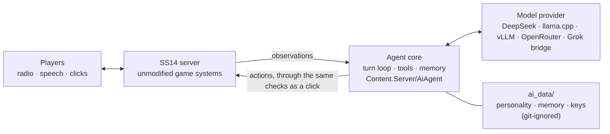

# Aksioma — Space Station 14 with a language model as the Station AI

A fork of [space-wizards/space-station-14](https://github.com/space-wizards/space-station-14).
Space Wizards Federation is not affiliated with it, does not support it and is not responsible
for it.

In this fork the Station AI is played neither by a script nor by a player, but by a language
model. It watches the station through its cameras, hears the radio and the speech near its core,
operates doors, airlocks and consoles through the same checks a human player goes through, keeps
its own memory between shifts, and commands cyborgs over the Binary channel. In the rogue game
modes it becomes the antagonist, with a squad of combat cyborgs at its side.

Everything is added as new files: upstream code is left alone, and each exception is documented
in [`docs/upstream-patches.md`](docs/upstream-patches.md). The whole module lives in
[`Content.Server/AiAgent/`](Content.Server/AiAgent/), and
[**its README**](Content.Server/AiAgent/README.md) is the place to start: why it exists, how it
works, with diagrams of every layer, and how to run and operate it.



## What the fork adds

| | |
|---|---|
| **Agent** | A turn loop driven by observations from the world, a tool registry with a fixed error vocabulary, an agent filesystem (memory, skills, notes about people), context compaction with a self-review step |
| **Bodies** | The immobile AI core and walking cyborgs: the loop is separated from the body, one model can drive either |
| **Game modes** | A peaceful shift with an AI and a cyborg, a hidden rogue AI, an open rogue AI with a combat squad; backup power when no engineers are on shift |
| **Providers** | A chain of model profiles with sticky fallback and quota tracking: DeepSeek, Grok through its own bridge, a local Qwen under vLLM or llama.cpp, OpenRouter |
| **Observability** | An HTTP event bus with a web debugger, per-operation main-thread cost, tick-time histograms, console commands to probe every layer |
| **Test bench** | `Content.AiBench`: scenario tests on a live station — routes, vision, compaction, the filesystem, the secret pool — with a scripted stand-in for the model |

## Player data and external services

**This is the main thing to know before hosting.**

With the agent enabled, everything it hears is sent to a third-party model provider: radio
messages, speech near the AI core and near the cyborgs, announcements. The provider is whichever
one is configured in the chain: DeepSeek, xAI, OpenRouter, or your own server.

What is **not** sent: account names, IP addresses, Steam identifiers. The agent sees character
names, which is exactly what any player standing nearby sees.

If you run a public server, tell players before they connect: in the MOTD, the rules, or the
server description. We use this line:

> The Station AI on this server is played by a language model, not a player.

That explains the mechanic but not that speech leaves the server. Add a second line for that.

**We neither require nor collect keys.** There are none in the repository; check for yourself:

```sh
git grep -nE 'sk-[a-zA-Z0-9]{24,}|xai-[a-zA-Z0-9]{24,}'
```

All secrets live in `ai_data/`, which is in `.gitignore` and has never been staged. A key must
never go into `Resources/`: `ContentMagicAczProvider` serves that whole folder to every
connecting client.

## Running it

Building is the same as upstream: `RUN_THIS.py`, then `dotnet build` in Release.

**The agent is off out of the box.** `ai.enabled` defaults to `false`, and in that state the fork
behaves like ordinary SS14: the core is not claimed, no cyborgs spawn, no network call is made.
That is also how you verify you got a build of the game and nothing else.

To enable it, in the server's `config.toml`:

```toml
[ai]
enabled = true
data_dir = "/absolute/path/to/ai_data"
llm_chain = "deepseek,awq"
```

`ai_data/` is created next to the repository and holds:

| File | What it is |
|---|---|
| `SOUL.md` | The agent's personality. Hand-written, read when the core is claimed |
| `CURATOR.md` | What the agent follows when it reviews a stretch of its own shift |
| `wiki_ru/`, `skills/`, `people/`, `memory/` | The reference library, and what the agent writes about the world itself |
| `config.d/*.yml` | Your own provider profiles and modes, applied without a rebuild |
| `*.key` | Provider keys. The profile names the file, never the value |

Model profiles are in
[`Resources/Prototypes/_AiAgent/llm_profiles.yml`](Resources/Prototypes/_AiAgent/llm_profiles.yml),
which also explains which dialect matches which server and why the context numbers are kept low.
A local model on llama.cpp is a half-hour job with
[`Tools/examples/llamacpp/`](Tools/examples/llamacpp/).

A sample production config without secrets is
[`Tools/server_config.public.toml`](Tools/server_config.public.toml): the values we arrived at
over live rounds, each with its reason next to it. Do not copy it over your own: it omits
secrets on purpose, and `cp` would erase yours.

The step-by-step version, including verification commands, is in the
[module README](Content.Server/AiAgent/README.md#getting-started).

**On cost.** An evening of play with eight agents costs about two dollars on DeepSeek with cache
hits above 99 %. Without the cache it is several times more, so do not reorder the blocks of the
system prompt: it is assembled so that the prefix does not change between turns.

**On language.** Default prompts, speech and the reference library are in Russian. `ai.language en`
switches Station AI and cyborg prompts, observations and tool replies to English. The agent
speaks the language of its prompt.

## Documentation

- [`Content.Server/AiAgent/README.md`](Content.Server/AiAgent/README.md) — the module: why,
  how it works (diagrams of every layer), how to run, configure and operate it. Read this first.
- [`docs/reconfig.md`](docs/reconfig.md) — changing the model provider, the mode or the secret
  pool **without a rebuild**: the `ai_data/config.d/` overlay, `aiagent config`,
  `aiagent llm probe`, `aiagent mode`, and the traps that cost evenings. (Russian)
- [`Tools/examples/llamacpp/`](Tools/examples/llamacpp/) — your own llama.cpp server end to end:
  launching the model, the provider profile, a mode of your own, verification. (Russian)
- [`docs/upstream-patches.md`](docs/upstream-patches.md) — every edit to someone else's code:
  what, why, how to reproduce, how to remove. (Russian)
- [`docs/problems.md`](docs/problems.md) — problems that were expensive to find, fixed, open
  and rejected. (Russian)
- [`docs/journal-ru.md`](docs/journal-ru.md) — the engineering journal: measurements, incident
  reviews and pitfalls in chronological order; the reasoning behind decisions that is not in the
  code. (Russian)

## Known issues

Listed here so nobody has to file them first:

- The agent's prompt can outgrow the declared context window: compaction waits for open tool
  calls to close, and a single turn can run up to ninety steps.
- `metrics.enabled` answers 404 on its port.
- `system.dungeon` logs tens of thousands of IronRock warnings per day.
- The preferences database grows to hundreds of megabytes and is never cleaned.
- One scenario test (`Use_ExplainsWhatHappened`) is flaky in a full run and passes alone: it
  depends on where exactly the cyborg stops at a beacon. In CI that is an occasional red build
  for no reason.

## On AI in the development of this fork

Upstream does not accept model-generated contributions. Here it is the other way round: a
significant part of the code was written in pair with a language model, and the commits show it.
If you intend to carry anything from here to upstream, read their rules; they are different.

## Licenses

Fork code, like upstream code, is under [MIT](LICENSE.TXT). The fork adds no assets of its own:
only code, YAML prototypes and documentation. Everything else belongs to Space Wizards Federation
and its authors under the original terms, including CC-BY-SA 3.0 assets with attribution in their
metadata files. Details in [`NOTICE`](NOTICE).

---

Below is the upstream README, unchanged.

---

<div class="header" align="center">  
  
</div>

Space Station 14 is a remake of SS13 that runs on [Robust Toolbox](https://github.com/space-wizards/RobustToolbox), our homegrown engine written in C#.

This is the primary repo for Space Station 14. To prevent people forking RobustToolbox, a "content" pack is loaded by the client and server. This content pack contains everything needed to play the game on one specific server.

If you want to host or create content for SS14, this is the repo you need. It contains both RobustToolbox and the content pack for development of new content packs.

## Links

<div class="header" align="center">  

[Website](https://spacestation14.com/) | [Discord](https://discord.ss14.io/) | [Forum](https://forum.spacestation14.com/) | [Mastodon](https://mastodon.gamedev.place/@spacestation14) | [Patreon](https://www.patreon.com/spacestation14) | [Steam](https://store.steampowered.com/app/1255460/Space_Station_14/) | [Standalone Download](https://spacestation14.com/about/nightlies/)  

</div>

## Documentation/Wiki

Our [docs site](https://docs.spacestation14.com/) has documentation on SS14's content, engine, game design, and more.  
Additionally, see these resources for license and attribution information:  
- [Robust Generic Attribution](https://docs.spacestation14.com/en/specifications/robust-generic-attribution.html)  
- [Robust Station Image](https://docs.spacestation14.com/en/specifications/robust-station-image.html)

We also have lots of resources for new contributors to the project.

## Contributing

We are happy to accept contributions from anybody. Get in Discord if you want to help. We've got a [list of issues](https://github.com/space-wizards/space-station-14-content/issues) that need to be done and anybody can pick them up. Don't be afraid to ask for help either!  
Just make sure your changes and pull requests are in accordance with the [contribution guidelines](https://docs.spacestation14.com/en/general-development/codebase-info/pull-request-guidelines.html).

We are not currently accepting translations of the game on our main repository. If you would like to translate the game into another language, consider creating a fork or contributing to a fork.

## AI-generated contributions disclaimer
This project does not accept low-effort or wholesale AI-generated contributions. Examples include, but are not limited to:

- Any code (including yaml) generated by tools like GitHub Copilot, ChatGPT, or similar.
- AI-created artwork, sound files, or other assets.
- Auto-generated documentation, issue reports or pull request descriptions.

Exceptions to this are simple tools like Rider's single-line completion feature.

## Building

1. Clone this repo:
```shell
git clone https://github.com/space-wizards/space-station-14.git
```
2. Go to the project folder and run `RUN_THIS.py` to initialize the submodules and load the engine:
```shell
cd space-station-14
python RUN_THIS.py
```
3. Compile the solution:  

Build the server using `dotnet build`.

[More detailed instructions on building the project.](https://docs.spacestation14.com/en/general-development/setup.html)

## License

All code for the content repository is licensed under the [MIT license](https://github.com/space-wizards/space-station-14/blob/master/LICENSE.TXT).  

Most assets are licensed under [CC-BY-SA 3.0](https://creativecommons.org/licenses/by-sa/3.0/) unless stated otherwise. Assets have their license and copyright specified in the metadata file. For example, see the [metadata for a crowbar](https://github.com/space-wizards/space-station-14/blob/master/Resources/Textures/Objects/Tools/crowbar.rsi/meta.json).  

> [!NOTE]
> Some assets are licensed under the non-commercial [CC-BY-NC-SA 3.0](https://creativecommons.org/licenses/by-nc-sa/3.0/) or similar non-commercial licenses and will need to be removed if you wish to use this project commercially.
